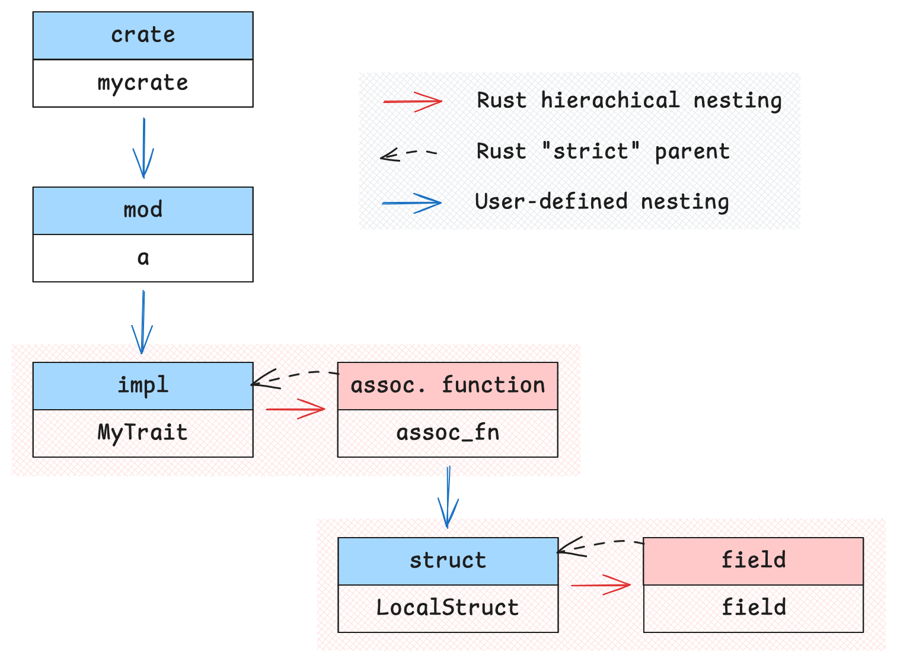

---
authors:
  - lucas
title: "Redesigning Global Identifiers in hax"
date: 2025-03-19
---

# Redesigning Global Identifiers in hax

A careful treatment of identifiers lies at the heart of all code analysis frameworks, and we hope our experience here proves useful to others.

In Rust, global identifier serves to uniquely locate uniquely an item: for instance `::serde::ser::Serialize` designates the `Serialize` trait from the Serde library. In constrat, local identifiers are relative, limited to the scope in which they are declared.

## Global Identifiers from the Rust Compiler

Initially, hax assumed that all identifiers originated exclusively from Rust. While this assumption held in the early stages, it was eventually challenged as the system grew. As hax evolved, new requirements emerged, prompting the engine to generate identifiers internally:

- **Trait pre- and post-conditions:** in hax, these are explicitly represented as concrete methods within typeclasses. Conversely, in Rust, these conditions exist only as anonymous standalone functions.
- **Explicit enum cast operations:** enum casts are primitive operations in Rust, but hax treats these casts as specialized operations, assigning distinct identifiers to them.
- **Cross-module mutually recursive item bundles:** these bundles[^1] are internally introduced by hax, necessitating the generation of unique identifiers to prevent naming conflicts.

[^1]: Rust supports cross-module mutual recursion without enforcing declaration order, an uncommon feature among programming languages. In contrast, most of our backends require some form of forward declaration. To bridge this gap and accommodate Rust’s permissive namespacing, we group related items into bundles and reorder them to eliminate cross-module recursion.

Moreover, the previous identifier system lacked detailed metadata, such as the type of identifier (struct, function, type, etc.), complicating identifier rendering for backend tools.

## Issues with the Previous Design

Initially, identifiers were represented using slightly modified Rust `DefId`s accompanied by minimal metadata indicating the identifier's kind. This approach presumed that hax would never alter these `DefId`s but merely use those directly produced by the Rust compiler.

This assumption was quickly challenged. The need to prefix or suffix identifiers emerged early, but the introduction of new internal modules completely disrupted the assumption. Identifiers had to be relocated across modules, representing a significant departure from the original design.

As the API for manipulating identifiers grew increasingly permissive and transparent, the foundational assumption—that `DefId`s were unique, consistent, and Rust-generated—was entirely undermined. This resulted in numerous bugs in identifier rendering in backend outputs, leading to at least 16 documented issues ([#1135](https://github.com/cryspen/hax/issues/1135)).

## Our New Approach

The frontend has been enhanced to explicitly indicate the kind of each identifier, clarifying whether it represents a function, an associated type, a constant, etc. Additionally, it now provides detailed parent information, making the origin of identifiers more transparent. Alongside these improvements, we have redesigned our internal engine's identifier representation, introducing a layered structure where each layer addresses a distinct aspect.

1. **Raw Rust Identifiers:** using Rust's `DefId` type, generated from Rust to OCaml, with minor normalization to address potential duplicate references. These identifiers are immutable and cannot be arbitrarily created or altered.

2. **Explicit_def_id:** addresses Rust's ambiguity between a struct constructor and the type itself, explicitly distinguishing identifiers belonging to types from those belonging to values, enhancing clarity for backend translation.

3. **Concrete_ident:** built upon `Explicit_def_id`, this layer adds capabilities for generating fresh module names or adding hygienic suffixes. It ensures identifier uniqueness and declares constraints clearly when creating new names or namespaces.

### Simplified Identifier Views

Rust's namespace structure is highly flexible, allowing various forms of nesting, such as types within functions, functions within constants, and more.

Broadly, there are two kinds of nesting in Rust. Consider the following snippet:

```rust
mod a {
    impl MyTrait for MyType {
        fn assoc_fn() {
            struct LocalStruct {
                field: u8,
            };
        }
   }
}
```

In this example, the user has intentionally placed `LocalStruct` within the method `assoc_fn`, which itself resides inside the module `a`. This is an instance of **user-driven nesting**, where the developer freely organizes elements within the code for clarity, convenience, or structural preference.

At the same time, we observe another form of nesting: `field` is contained within `LocalStruct`, and `assoc_fn` is enclosed within the `impl` block implementing `MyTrait` for `MyType`. This represents **hierarchical nesting**, which is dictated by the Rust language itself. Unlike user-driven nesting, hierarchical relationships are inherent to Rust's type system: a field **must** belong to a struct or an enum variant, and a method **must** exist within an impl block.

The following diagram shows how these hierarchical relationships are structured.



Distinguishing between these two types of nesting is crucial when rendering names. Hierarchical nesting often requires special handling in backends due to its structural constraints, whereas user-driven nesting primarily serves readability and organization.


To manage this effectively, we introduced a hierarchical view for identifiers. Instead of handling Rust's deeply nested identifier paths as-is, we transform them into structured, relational representations. This approach simplifies backend processing, minimizes namespace conflicts, and ensures better compatibility with backend language constraints.

## Conclusion: Say Goodbye to Naming Issues (Almost)!

This comprehensive redesign of identifier representation and handling has resolved most previously identified naming issues and significantly enhanced the expressiveness and robustness of backend identifier rendering in hax.

Check out the pull request [#1199](https://github.com/cryspen/hax/pull/1199) on the GitHub repository of hax for more details!

We are confident that this enhanced representation is sufficiently robust and flexible to accommodate future developments and evolving project requirements.
